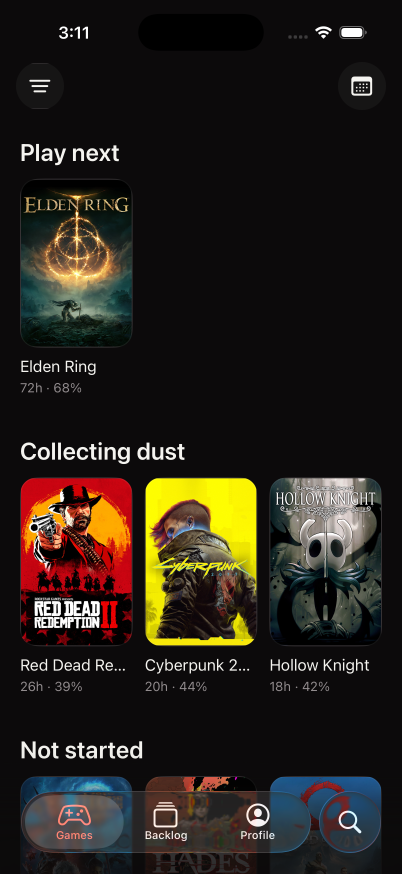
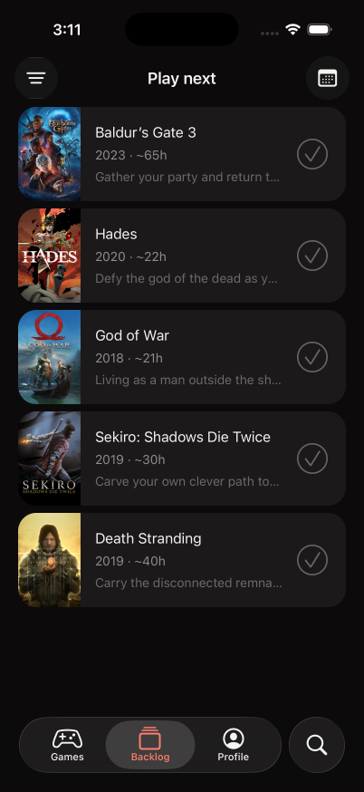
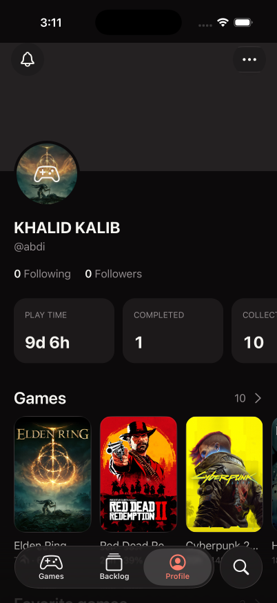
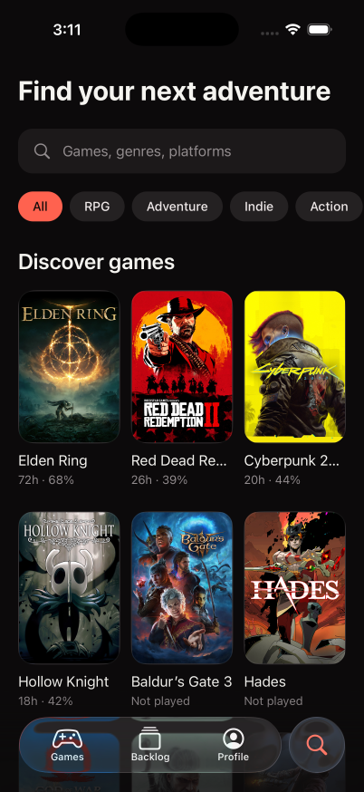
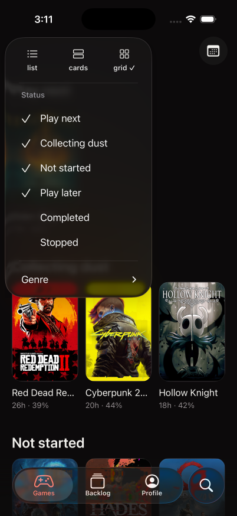

# Native iOS visual review

## Reference

The supplied images show Bingers: TV & Movie Tracker (Onbox Labs), App Store ID 6792080029. The application is adapted for games, not video playback. Reference links: https://bingers.app/ and https://apps.apple.com/sa/app/bingers-tv-movie-tracker/id6792080029.

The reference images are 709 × 1536. The native comparison was performed in dark appearance on an iPhone 17 Pro simulator running iOS 26.0.

## Implemented design measurements

| Element | Gamefolio target |
| --- | --- |
| Canvas | #0c0a0b |
| Cards | #1c191a |
| Primary text | #f5f4f0 |
| Secondary text | #928c8e |
| Selection | #ff624f |
| Horizontal padding | 20pt |
| Grid columns / gap | 3 / 12pt |
| Cover aspect ratio | 2:3 |
| Cover corner radius | 17pt, continuous |
| Section title | 24pt semibold |
| Card title / progress | 16pt / 13pt |
| Section spacing | 40pt |
| List row / poster width | 104pt / 69pt |
| Profile banner / avatar | 242pt / 96pt |
| Toolbar controls | native SwiftUI glass, circular 48pt target |
| Bottom navigation | system-native iOS 26 tabs, separate search role |

## Captured screens

| Games | Backlog | Profile |
| --- | --- | --- |
|  |  |  |

| Search | Native filter menu |
| --- | --- |
|  |  |

## Observed verification results

- Tested commit: `1ec12ca302f195db0561a8be93d1b79e7e4bd76a`.
- GitHub Actions run: `35681745444`, artifact `10675355742`.
- Device: iPhone 17 Pro simulator, iOS 26.0.
- Native app build, install and launch: passed.
- Games, Backlog, Profile, Search and expanded filter menu screenshots: passed.
- Accessibility snapshots: passed for all five screens.
- TypeScript and formatting: passed.
- Storage validation tests: 5 passed.
- Explicit simulator shutdown: passed.

The captured layout matches the reference proportions: 20pt page insets, three 2:3 covers per row, 12pt grid gaps, continuous card corners, floating native tabs and a separate search tab. The toolbar controls are circular 48pt SwiftUI glass buttons. The visible profile banner ends at 247pt on the test device, matching the scaled reference, with its avatar overlapping the lower edge.

The filter is rendered with `@expo/ui/swift-ui`. Its glass popover, view selector, checked status rows and Genre disclosure match the native iOS menu shown in the reference. The bottom navigation is rendered by Expo Router Native Tabs and uses the iOS 26 system material.

The `visual-qa.yml` workflow repeats this review for interface changes, uploads PNG screenshots and accessibility snapshots, then explicitly shuts down every booted iOS simulator.

## Manual release checks

1. Add a game through Search, change its status, progress, hours, notes and rating, then force-close and reopen to confirm persistence.
2. Exercise the share sheet, removal confirmation and profile form on a physical device.
3. Check a small iPhone, larger text and failed artwork requests while keeping 44pt touch targets.
